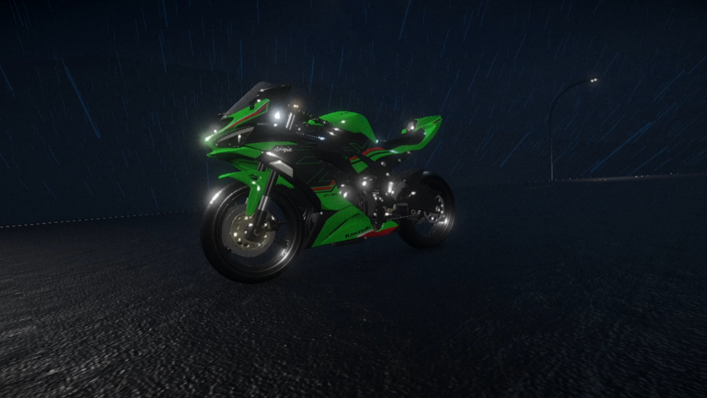
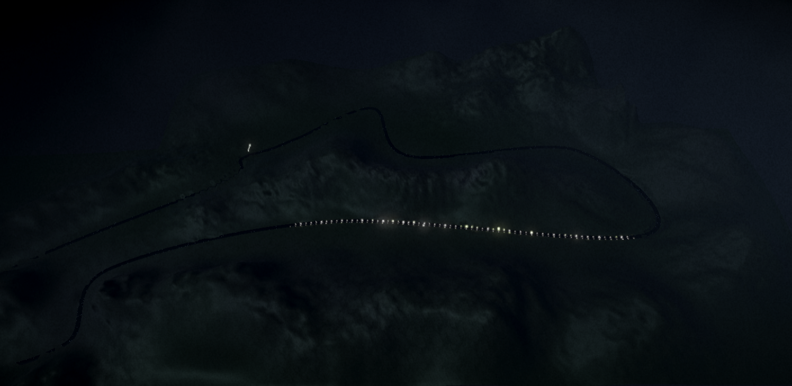

# Sportbike Sim

A physics-accurate 600cc sportbike simulation built in Unity 6, focused on 
realistic handling and procedural audio synthesis.

## Overview

A rainy, atmospheric speedrun demo. Ride around the full track as fast 
as possible without losing control. Handling is intentionally realistic

*(easy at low speeds, increasingly difficult as you push the throttle.)*

Just like a real bike.

(*this project exclusively supports controller input to take advantage of the analog nature required to operate a machine such as this*)

## Technical Systems

### Engine Audio Synthesis

The centerpiece of the project. Engine sound is generated in real-time 
using granular synthesis driven directly by the simulated engine state. 

No pre-recorded engine loops: the audio is synthesized procedurally 
based on RPM output from the drivetrain simulation.

*(I designed it using reference clips and tuned the parameters until I got something that sounded close, the clips were originally in the project but too big to store on Github)*

### Drivetrain Simulation

- Gear system with realistic gear ratios (taken directly from real numbers on a Kawasaki ZX6R Sportbike)
- Torque curves driving wheel force
- RPM calculated from gear, speed, and throttle input
- RPM feeds directly into the audio synthesizer
- Downshifts raise rpm, upshifts lower it.

### Physics

- Built on Unity Wheel Collider 3D (Asset Store) with custom physics forces layered on top
- All acceleration energy runs through the wheel controllers (no shortcuts)
- Steering is speed-sensitive with slight assist (full simulation planned for future)
- Suspension reacts dynamically to terrain and load
- Front forks animate and turn physically
- Realistic weight and momentum — the bike resists direction changes at speed

### Procedural Audio
- Wind synthesis that responds to speed
- GoPro-style mic clipping simulation at high speeds
- Tucking behind the windshield (click right stick) reduces wind noise
  and clipping, simulating real camera placement behavior

## Controls
- Throttle / brake as expected
- Click the right stick to tuck behind windshield
- Steering gets progressively harder at speed
*(back off the throttle to recover)*
- Right bumper to shift up, left to shift down.

## Status

Playable demo. Timer at top of screen. Basic but with some polish.

## Future Plans

The engine audio system is currently granular synthesis driven by RPM. 
The long-term goal is a full waveguide physical engine audio simulator 
(modeling the actual acoustics of combustion and exhaust rather than synthesizing through the current method).

It's my ultimate goal to implement a full engine simulation, waveguide audio simulation, and everything that meaningfully contributes to the experience (within reason and hardware limitations)

Also you currently cant fall off the bike from leaning too much, an "expert mode" where you have full control (similar to the difference between an fpv drones controls vs a retail drones controls) eg: full assist vs no assist

## Built With
- Unity 6 (URP)
- Unity Audio / custom granular synthesis system
- Unity Wheel Colliders + custom physics forces